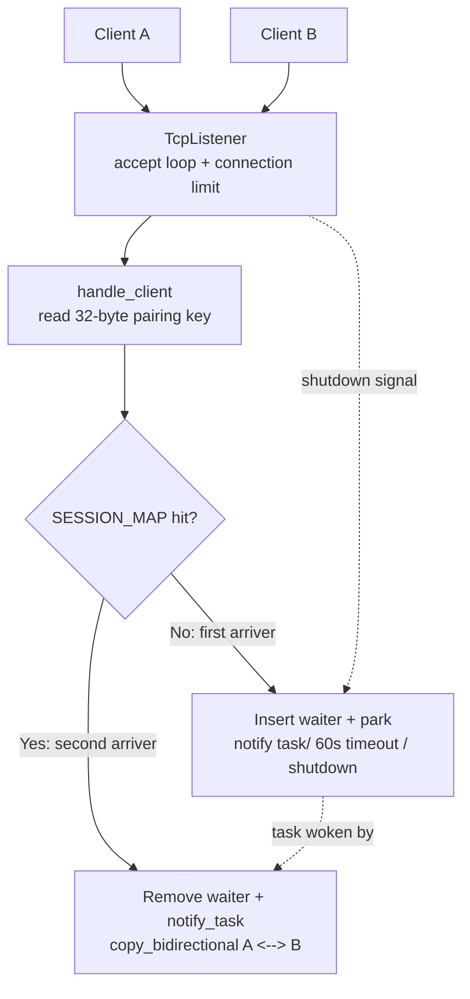

Simple duplex relay server over TCP

**Overview**

```mermaid
flowchart TB
    A[Client A] --> S[TcpListener<br/>accept loop + connection limit]
    B[Client B] --> S
    S --> H[handle_client<br/>read 32-byte pairing key]
    H --> M{SESSION_MAP hit?}
    M -- No: first arriver --> W[Insert waiter + park<br/>notify task/ 60s timeout / shutdown]
    M -- Yes: second arriver --> P[Remove waiter + notify_task<br/>copy_bidirectional A &lt;--&gt; B]
    W -. task woken by .-> P
    S -. shutdown signal .-> W
```
